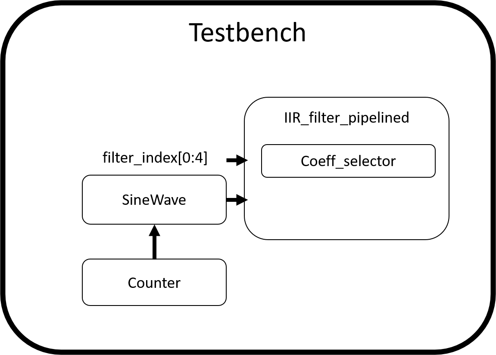
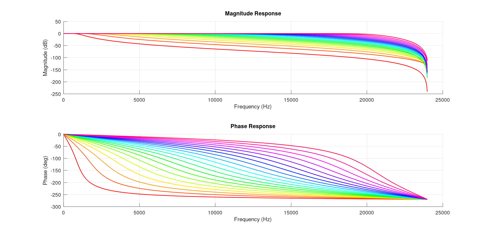
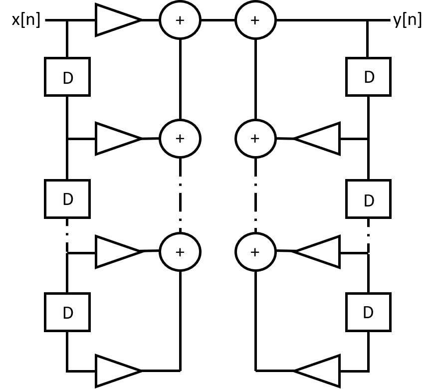
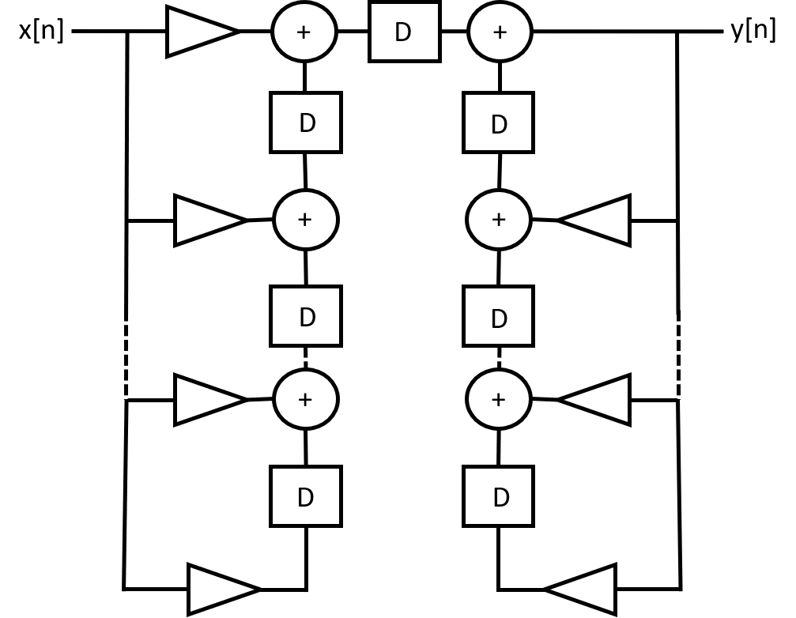
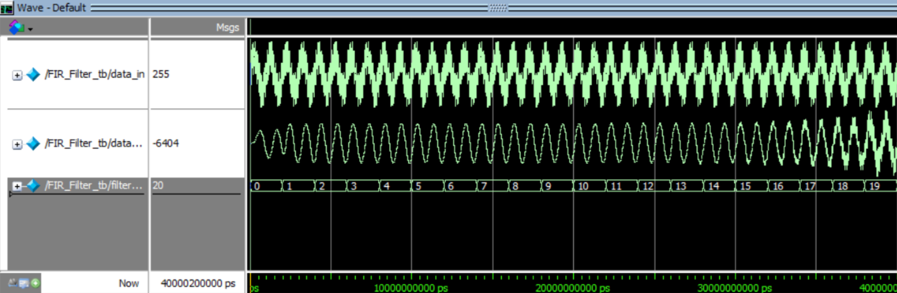
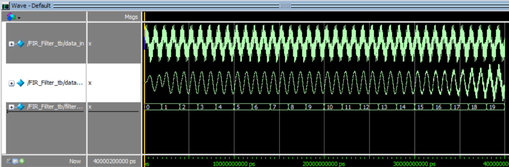

# Digital Equalizer Implementation with Pipelined 4th Order IIR Filter

## Overview

This project implements a digital equalizer (EQ) designed to process audio signals in real time. It compares the performance of a pipelined 4th order IIR filter with a traditional 4th order IIR filter. The design emphasizes low latency, precision with efficient resource management, and dynamic filter response, utilizing both feedback and feed-forward paths.

## Objective

- **Implement a digital equalizer (EQ)** that processes audio signals in real time using:
  - A pipelined 4th order IIR filter.
  - Comparison with the traditional 4th order IIR design.

## Repository Structure and Getting Started
The repository is organized to align with the project report and **includes the following folders**:
- **IIR Filter:**  
  Contains Verilog designs for Non-Varible IIR Filter, test benches, and Coeficients folder.
- **IIR_Varible_Filter:**  
  Contains Verilog designs for Varible IIR Filter, test benches, and Coeficients folder.
- **IIR_Varible_Filter_Pipedlined:**  
  Contains Verilog designs for Pipedlined Varible IIR Filter, test benches. 
- **Coeficients:**  
  - **Generate_test_vector.m:** Generates test vectors from a sum of sine waves.
  - **Get_Coefs_file.m:** Creates SystemVerilog 3D array initialization statements for filter coefficients.
  - **Get_Coefs_magnitude_phase_plot.m:** Plots the magnitude and phase response of the generated filters.

**Getting Started:**
1. **Simulation:**  
   Use ModelSim or your preferred Verilog simulator to run the test benches in each project folder.
2. **Synthesis:**  
   Use tools such as Quartus or Vivado if synthesis is required for further hardware implementation analysis.
3. **Octave Environment:**  
   Ensure Octave GNU is installed with necessary libraries to run the coefficient processing/generation scripts.

## Prerequisites

- **Verilog/SystemVerilog Simulator:** For simulation of FIR filter designs.
- **Synthesis Tools:** Such as Quartus or Vivado.
- **Octave GNU:** Along with required libraries (e.g., Comunications/Signals).

## Testbench Structure

The main testbench `FIR_Filter_tb` instantiates and integrates various modules including:

- **Iir_filter_pipelined:** Implements the pipelined IIR filter.
- **Coeff_selector:** Selects filter coefficients from a 3D coefficient memory array.
- **SineWave:** Generates a sine wave based on data read from an external binary file.
- **Counter:** Provides a counter signal for addressing.

## Filter Frequency Response and Quantization Effects

- **Frequency Response:** The ideal filter exhibits a clear passband with a steep transition. Post-quantization, minor deviations are observed; however, careful scaling and rounding ensure that the stopband attenuation remains at or above 80 dB.
- **Quantization & Overflow Management:** Filter coefficients are quantized to a signed 16-bit representation. Additional techniques (proper scaling of inputs and intermediate registers during MAC operations) are implemented to prevent arithmetic overflow.

## IIR Filter Architectures

### Architectural Variants

To balance performance and resource usage, these architectures were explored:
- **Traditional (Direct Form I) Architecture:** Descripition goes here

- **Pipelined Architecture:** Descripition goes here

## Model Sim Results

This section summarizes the key performance metrics and simulation outcomes:

- **Simulation Validation:**  
  Simulation results confirm that the IIR filter effectively removes 20kHz from the input sine wave while maintaining the required 1kHz sine. Test bench outputs (graphs and waveform captures) validate that quantization effects remain minimal and the filter meets the design specifications.

<figure style="background-color: black; display: inline-block; padding: 10px;">
  
  <figcaption>Figure: Trad IIR Results</figcaption>
</figure>

<figure style="background-color: black; display: inline-block; padding: 10px;">
  
  <figcaption>Figure: Piped IIR Results</figcaption>
</figure>

## Design Compiler Report

A comparative analysis of the original IIR filter versus the pipelined version is provided below:

| Metric                  | Original IIR Filter | Pipelined IIR Filter | Improvement              |
|-------------------------|---------------------|----------------------|--------------------------|
| **Dynamic Power**       | 7.567 µW            | 852.387 nW           | ~89% reduction           |
| **Leakage Power**       | 20.893 µW           | 18.183 µW            | ~13% reduction           |
| **Total Cell Area**     | 2698.48 units       | 2140.48 units        | ~20% reduction           |
| **Combinational Area**  | 1376.93 units       | 953.15 units         | ~31% reduction           |
| **Number of Cells**     | 672                 | 564                  | ~16% reduction           |
| **Buf/Inv Count**       | 238                 | 147                  | ~38% reduction           |

## Portfolio and Contact

This repository is structured to showcase:
- **Clear Documentation:** Detailed explanations of design trade-offs and simulation results.
- **Modular Code:** Scalable, parameterized Verilog designs.
- **Professional Analysis:** A critical evaluation of performance metrics and hardware implementation results.

🔗 **Live Demo:** [GitHub Pages](https://github.com/PaulNation/Advanced-VLSI-Project-REPO)   
🌐 **Website:** [paulnieves.com](https://paulnieves.com)   
📧 **Contact:** nievep@rpi.edu

