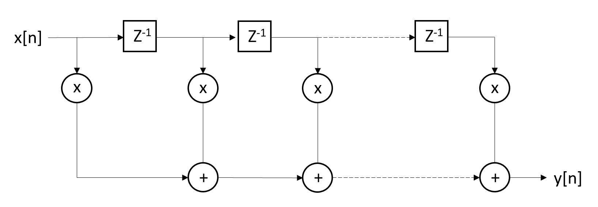
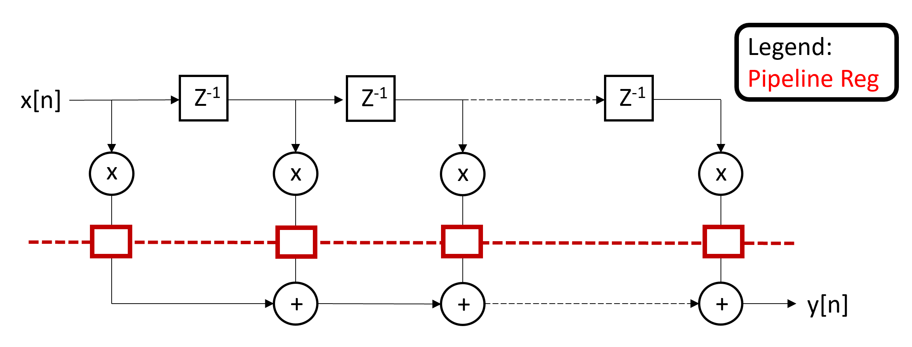

# Advanced VLSI Project Repository

This repository contains the source code, design files, and scripts for an advanced VLSI projects focused on implementing FIR filter architectures with reduced-complexity parallel processing techniques.

---

## Abstract

This project demonstrates the design and implementation of a 102-tap low‐pass FIR filter. The design removes noise from a 1 kHz sine wave while meeting stringent specifications (a transition region between 0.2π and 0.23π rad/sample and at least 80 dB stopband attenuation). A combination of MATLAB, Python, and Verilog is used to develop and analyze multiple architectures—including traditional, pipelined, and parallel processing approaches—to achieve high performance on FPGA hardware.

---

## MATLAB FIR Filter Design and Simulation

### Implementation Details

- **Filter Design:** MATLAB’s built-in functions were used to generate an ideal (un-quantized) 102-tap low-pass FIR filter.
- **Noisy Input Generation:** A script (`sin_gen.m`) produces a clean 1 kHz sine wave, adds white Gaussian noise (using a specified SNR), scales the signal to a 16-bit range, and saves its binary representation. This binary file is used as test input for the simulation of the Verilog designs.

### Simulation Setup

- The noisy sine wave serves as the test input in FPGA simulation tools (e.g., ModelSim), allowing verification that the FIR filter removes noise while preserving the desired signal characteristics.

---

## Filter Frequency Response and Quantization Effects

- **Frequency Response:** The ideal filter exhibits a clear passband with a steep transition. Post-quantization, minor deviations are observed; however, careful scaling and rounding ensure that the stopband attenuation remains at or above 80 dB.
- **Quantization & Overflow Management:** Filter coefficients are quantized to a signed 32-bit representation. Additional techniques (proper scaling of inputs and intermediate registers during MAC operations) are implemented to prevent arithmetic overflow.

---

## FIR Filter Architecture

### Architectural Variants

To balance performance and resource usage, several architectures were explored:
- **Traditional (Direct) Architecture:** A simple multiply-accumulate (MAC) approach, easy to implement but with limited throughput.

- **Pipelined Architecture:** The MAC operation is divided into stages, which improves throughput by overlapping operations.

- **Parallel Processing Architectures:**
  - **L=2 Parallel Processing:** The filter coefficients are split into two sub-filters (even and odd indices) to effectively double the throughput.

  - **L=3 Parallel Processing:** The filter is partitioned into three sub-filters, further increasing data rates.

  - **Combined Pipelining and L=3:** This variant integrates pipelining within the L=3 structure to further reduce critical path delays and allow higher clock frequencies.

### Code Structure and Coefficient Processing

- **Verilog Modules:** The design is organized into modular components (delay lines, coefficient loaders, and MAC units with pipelining).
- **Coefficient Generation:** A Python script (`floatmakercoeficent.py`) reads the full coefficient set, applies polyphase decomposition (splitting into H0, H1 for L=2 or H0, H1, H2 for L=3), computes optimized coefficient sums, and converts coefficients into a 32-bit binary format for FPGA use.

---

## Hardware Implementation Results

The FIR filter designs were synthesized using Synopsys Design Compiler targeting gscl45nm technology. Key findings include:

- **Area Utilization:**
  - **Pipelined Design:** ~811 cell units.
  - **L=2 Parallel Processing:** ~1,763 cell units.
  - **L=3 Parallel Processing:** ~5,624 cell units.
  - **Combined Pipelined & L=3:** ~13,831 cell units.
- **Clock Frequency:** Explicit values were not provided due to undefined clock warnings; however, design improvements aim for higher frequencies suitable for real-time filtering.
- **Power Estimation:**
  - **Pipelined:** Negligible dynamic power (~0 μW) with leakage of ~8.22 μW.
  - **L=2 Architecture:** Total power ~29.51 μW.
  - **L=3 Architecture:** Total power ~126.43 μW.
  - **Combined Pipelined & L=3:** Total power ~351.29 μW.

---

## Results

This section summarizes the key performance metrics and simulation outcomes:

- **Synthesis Metrics Summary:**  
  A detailed summary table (included in the full report) shows trade-offs between different architectures, highlighting the increased area and power consumption associated with parallel processing versus the simpler pipelined design.
  
- **Simulation Validation:**  
  Simulation results confirm that the FIR filter effectively removes noise from the input sine wave while maintaining the required frequency response. Test bench outputs (graphs and waveform captures) validate that quantization effects remain minimal and the filter meets the design specifications.

- **Design Trade-offs:**  
  The project demonstrates the balance between performance and complexity. While the L=3 parallel architecture (especially when combined with pipelining) offers significant throughput improvements, it incurs higher area and power costs compared to the basic pipelined approach.

---

## Repository Structure and Getting Started

The repository is organized to align with the project report and includes the following folders:

- **Fully Pipelined FIR Filter:**  
  Contains Verilog designs, test benches, and simulation scripts.
  
- **Reduced-Complexity Parallel Processing L=2 & L=3:**  
  Each folder includes Verilog designs, test benches, and Python scripts for polyphase decomposition and tap generation.
  
- **Combined Pipelined & L=3:**  
  Uses coefficients from the L=3 design to achieve higher performance.
  
- **Unquantized Coefs Comparison:**  
  Includes MATLAB scripts for generating frequency response comparisons between unquantized and quantized filters.
  
- **Noisy Sine Input Generator:**  
  Contains MATLAB scripts for generating the noisy 1 kHz sine wave test input.

**Getting Started:**

1. **Simulation:**  
   Use ModelSim or your preferred Verilog simulator to run the test benches in each project folder.

2. **Synthesis:**  
   Use tools such as Quartus or Vivado if synthesis is required for further hardware implementation analysis.

3. **Python Environment:**  
   Ensure Python 3.x is installed with necessary libraries (e.g., NumPy) to run the coefficient processing scripts.

4. **MATLAB Analysis:**  
   Open MATLAB and execute the scripts in the Unquantized Coefs Comparison folder to visualize and analyze the frequency responses.

---

## Prerequisites

- **Verilog/SystemVerilog Simulator:** For simulation of FIR filter designs.
- **Synthesis Tools:** Such as Quartus or Vivado.
- **Python 3.x:** Along with required libraries (e.g., NumPy).
- **MATLAB:** For executing analysis and visualization scripts.

---

## Portfolio and Contact

This repository is structured to showcase:
- **Clear Documentation:** Detailed explanations of design trade-offs and simulation results.
- **Modular Code:** Scalable, parameterized Verilog designs.
- **Professional Analysis:** A critical evaluation of performance metrics and hardware implementation results.

🔗 **Live Demo:** [GitHub Pages](https://github.com/PaulNation/Advanced-VLSI-Project-REPO)  
📧 **Contact:** nievep@rpi.edu